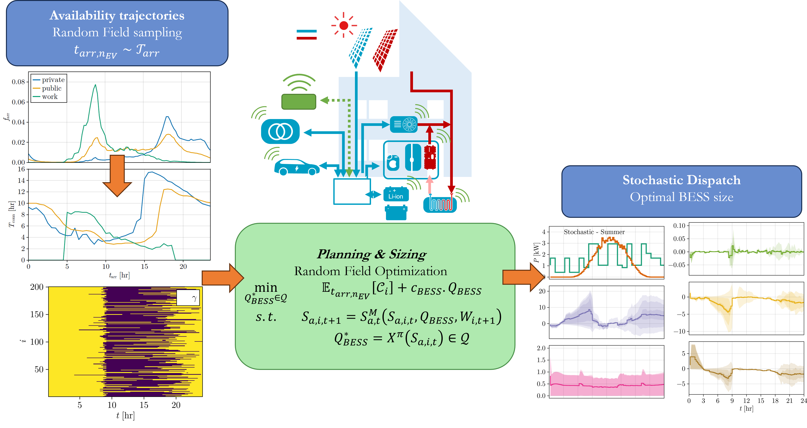

# Stochastic Mobility Integration into Residential Energy Hubs
## ESARS-ITEC24 26-29 November 2024

## Description

Code for reproducing the case studies of "Stochastic Mobility Integration into Residential Energy Hubs" presented in the ESARS-ITEC 2024 Conference held in Naples on 26-29th of November.

The code implements a stochastic optimization model for the integration of electric vehicles and residential energy hubs. The model is based on a single-stage stochastic programming formulation that considers the uncertainty in the mobility patterns of the electric vehicles. The problem is modelled using Random Field Optimization. The code is implemented in `Julia`, `JuMP` and `InfiniteOpt` and uses the `Ipopt` solver.

The pipeline of paper is as follows:



## Installation
Within a particular ecosystem, there may be a common way of installing things, such as using Yarn, NuGet, or Homebrew. However, consider the possibility that whoever is reading your README is a novice and would like more guidance. Listing specific steps helps remove ambiguity and gets people to using your project as quickly as possible. If it only runs in a specific context like a particular programming language version or operating system or has dependencies that have to be installed manually, also add a Requirements subsection.

```julia
julia> cd("[INSERT_PATH_TO_FILES]/StochMobilityMCES-ITEC24/")

julia> ]

(@v1.10) pkg> activate .

(itec24) pkg> instantiate

```

## Usage
The scripts in folder `src` build and optimize the models for the case studies presented in the paper. The scripts are organized as follows:

```apache
runCaseStudy1_DET.jl --> deterministic model for case study 1
runCaseStudy1_RFO.jl --> stochastic model for case study 1
runCaseStudy2_RFO.jl --> stochastic model for case study 2
```

to run the scripts, open a terminal and type:

```julia
julia> runCaseStudy1_DET.jl
```

All necessary functions are stored in `fns` folder. The data for the case studies is stored in `data` folder.

Results can be visualized in the `notebooks`. The notebooks are organized as follows:

```apache
cs1_analysis.ipynb --> analysis of the results for case study 1
cs2_analysis.ipynb --> analysis of the results for case study 2
```

## Support
For support on code usage please submit an issue on the repository.

## Authors and acknowledgment
This paper was done by Dario Slaifstein, Alvaro Menendez Agudin, Gautham Ram Chandra Mouli, Laura Ramirez Elizondo, and Pavol Bauer.

## License
For open source projects, say how it is licensed.